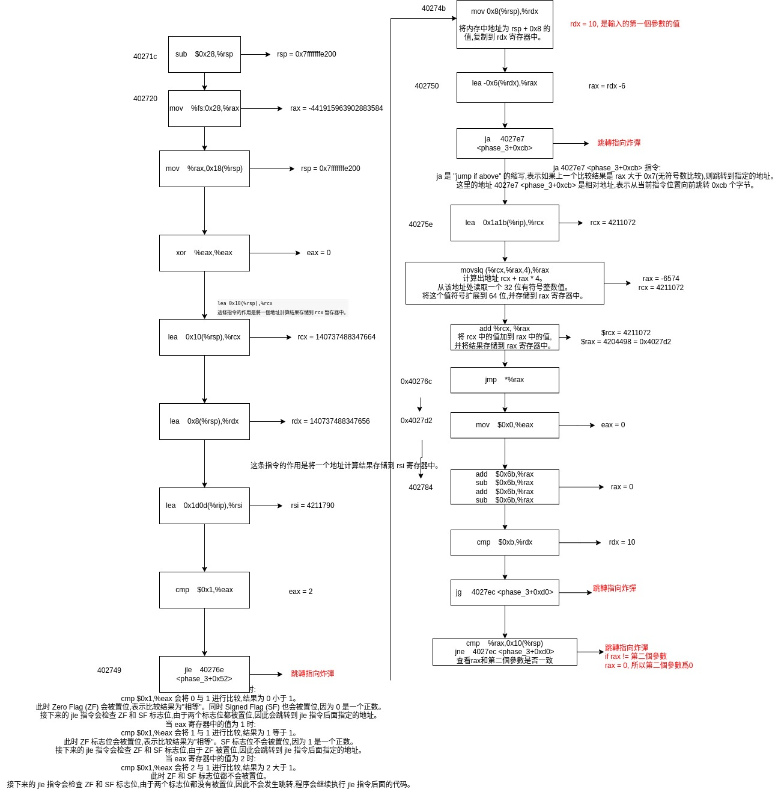
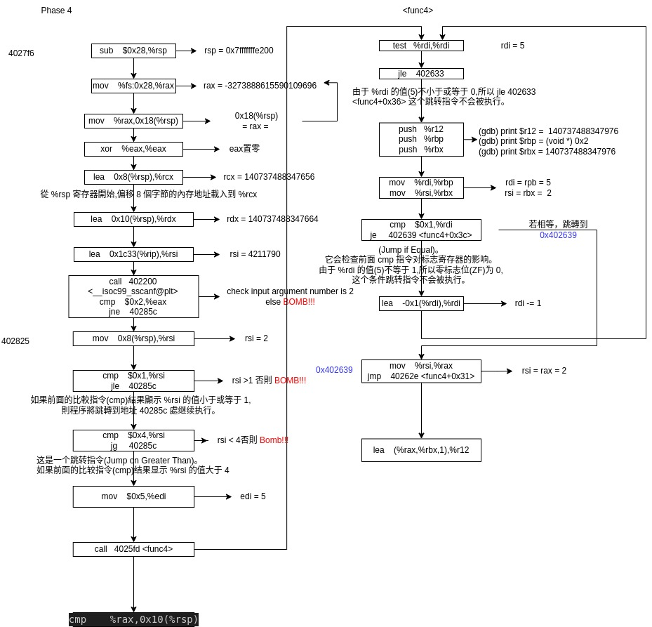

# Bomb Lab

## Phase 1
objdump -d bomb > bomb.as
Get the assemble code. Look into phase 1
```
000000000040268e <phase_1>:
  40268e: 48 83 ec 08           sub    $0x8,%rsp
  402692: 48 8d 35 87 4b 00 00  lea    0x4b87(%rip),%rsi        # 407220 <sval>
  402699: e8 26 0b 00 00        call   4031c4 <strings_not_equal>
  40269e: 84 c0                 test   %al,%al
  4026a0: 75 05                 jne    4026a7 <phase_1+0x19>
  4026a2: 48 83 c4 08           add    $0x8,%rsp
  4026a6: c3                    ret    
  4026a7: e8 34 0e 00 00        call   4034e0 <explode_bomb>

```
`strings_not_equal` is used to trigger the bomb.

```
00000000004031c4 <strings_not_equal>:
  4031c4: 41 54                 push   %r12
  4031c6: 55                    push   %rbp
  4031c7: 53                    push   %rbx
  4031c8: 48 89 fb              mov    %rdi,%rbx
  4031cb: 48 89 f5              mov    %rsi,%rbp
  4031ce: e8 dc ff ff ff        call   4031af <string_length>
  4031d3: 49 89 c4              mov    %rax,%r12
  4031d6: 48 89 ef              mov    %rbp,%rdi
  4031d9: e8 d1 ff ff ff        call   4031af <string_length>
  4031de: 49 39 c4              cmp    %rax,%r12
  4031e1: 74 12                 je     4031f5 <strings_not_equal+0x31>
  4031e3: b8 01 00 00 00        mov    $0x1,%eax
  4031e8: 5b                    pop    %rbx
  4031e9: 5d                    pop    %rbp
  4031ea: 41 5c                 pop    %r12
  4031ec: c3                    ret    
  4031ed: 48 83 c3 01           add    $0x1,%rbx
  4031f1: 48 83 c5 01           add    $0x1,%rbp
  4031f5: 0f b6 03              movzbl (%rbx),%eax
  4031f8: 84 c0                 test   %al,%al
  4031fa: 74 ec                 je     4031e8 <strings_not_equal+0x24>
  4031fc: 38 45 00              cmp    %al,0x0(%rbp)
  4031ff: 74 ec                 je     4031ed <strings_not_equal+0x29>
  403201: b8 01 00 00 00        mov    $0x1,%eax
  403206: eb e0                 jmp    4031e8 <strings_not_equal+0x24>

```
In this function, the register `%rdi` and `%rsi` are used to store the string. Therefore, we can use gdb to check what is in them.
```
$gdb bomb
(gdb) break strings_not_equal
(gdb) r
(gdb) p/s (char*)$rdi
(gdb) p/s (char*)$rsi
"Lisa Cortez chilled the old, lavendar pancake."
```
## Phase 2
```
00000000004026ac <phase_2>:
  4026ac: 48 83 ec 48           sub    $0x48,%rsp
  4026b0: 64 48 8b 04 25 28 00  mov    %fs:0x28,%rax
  4026b7: 00 00 
  4026b9: 48 89 44 24 38        mov    %rax,0x38(%rsp)
  4026be: 31 c0                 xor    %eax,%eax
  4026c0: 48 89 e6              mov    %rsp,%rsi
  4026c3: e8 4c 0e 00 00        call   403514 <read_six_numbers>
  4026c8: 48 83 3c 24 01        cmpq   $0x1,(%rsp)
  4026cd: 75 0f                 jne    4026de <phase_2+0x32>
  4026cf: 48 83 7c 24 08 01     cmpq   $0x1,0x8(%rsp)
  4026d5: 75 07                 jne    4026de <phase_2+0x32>
  4026d7: b8 02 00 00 00        mov    $0x2,%eax
  4026dc: eb 09                 jmp    4026e7 <phase_2+0x3b>
  4026de: e8 fd 0d 00 00        call   4034e0 <explode_bomb>
  4026e3: 48 83 c0 01           add    $0x1,%rax
  4026e7: 48 83 f8 05           cmp    $0x5,%rax
  4026eb: 77 15                 ja     402702 <phase_2+0x56>
  4026ed: 48 8b 54 c4 f8        mov    -0x8(%rsp,%rax,8),%rdx
  4026f2: 48 03 54 c4 f0        add    -0x10(%rsp,%rax,8),%rdx
  4026f7: 48 39 14 c4           cmp    %rdx,(%rsp,%rax,8)
  4026fb: 74 e6                 je     4026e3 <phase_2+0x37>
  4026fd: e8 de 0d 00 00        call   4034e0 <explode_bomb>
  402702: 48 8b 44 24 38        mov    0x38(%rsp),%rax
  402707: 64 48 2b 04 25 28 00  sub    %fs:0x28,%rax
  40270e: 00 00 
  402710: 75 05                 jne    402717 <phase_2+0x6b>
  402712: 48 83 c4 48           add    $0x48,%rsp
  402716: c3                    ret    
  402717: e8 04 fa ff ff        call   402120 <__stack_chk_fail@plt>
```
We can check out what is going on after `4026c3` by gdb break
```
(gdb) set args psol.txt
(gdb) break *0x4026c8
(gdb) r
(gdb) x $rsp
```
we can get this output, when we set the second line in psol.txt as 1:
```
Breakpoint 1, 0x00000000004026c8 in phase_2 ()
(gdb) x $rsp
0x7fffffffe1e0: 0x00000001
```
With more try, we know that the register `%rsp` is used to store the array. Then we translate the assemble code. 
- The code `cmpq $0x1,(%rsp)` is comparing the value at the memory address pointed to by the rsp (stack pointer) register with the hexadecimal value 0x1 (which is equivalent to the decimal value 1).
- `jne 4026de <phase_2+0x32>`:This is a conditional jump instruction, which stands for "jump if not equal".If the comparison in the previous instruction (`cmpq $0x1,(%rsp)`) resulted in the values being not equal, the program will jump to the instruction at the address 4026de (which is likely the label <phase_2+0x32>, which is the bomb).

Therefore, the first and second number is 1, 1.
From the code we know that the loop is doing the Fibonacci array check.
```
int i;
for (i = 2; i < 6; i++) {
    if (numbers[i] != numbers[i-2] + numbers[i-1]) {
        explode_bomb();
    }
}
```
Write [1, 1, 2, 3, 5, 8] in the second line, we can run the bomb and get
```
Welcome to my fiendish little bomb. You have 6 phases with
which to blow yourself up. Have a nice day!
Phase 1 defused. How about the next one?

That's number 2.  Keep going!
```
## Phase 3
Phase 3 code is longer...
```
000000000040271c <phase_3>:
  40271c: 48 83 ec 28           sub    $0x28,%rsp
  402720: 64 48 8b 04 25 28 00  mov    %fs:0x28,%rax
  402727: 00 00 
  402729: 48 89 44 24 18        mov    %rax,0x18(%rsp)
  40272e: 31 c0                 xor    %eax,%eax
  402730: 48 8d 4c 24 10        lea    0x10(%rsp),%rcx
  402735: 48 8d 54 24 08        lea    0x8(%rsp),%rdx
  40273a: 48 8d 35 0d 1d 00 00  lea    0x1d0d(%rip),%rsi        # 40444e <__PRETTY_FUNCTION__.0+0xce>
  402741: e8 ba fa ff ff        call   402200 <__isoc99_sscanf@plt>
  402746: 83 f8 01              cmp    $0x1,%eax
  402749: 7e 23                 jle    40276e <phase_3+0x52>  # !!!!!BOMB!!!!!

---------------------------------------------------------------------

 40276e:  e8 6d 0d 00 00        call   4034e0 <explode_bomb>
```
First look into the value of `%eax`, with more than 1 input. Set breakpoint after call   `402200 <__isoc99_sscanf@plt>`
```
(gdb) set args psol.txt
(gdb) break *0x402746
(gdb) run
(gdb) info r eax
```
get the output of:
```
Breakpoint 1, 0x0000000000402746 in phase_3 ()
(gdb) info r eax
eax            0x2                 2
```
Although we input more than one arguement, the eax is still 2. Therefore we know there are 2 argument in the sscanf. If the `eax` is 1, the `jle    40276e <phase_3+0x52>` will jump to `40276e` and explode bomb!!!
Next, look at this part:
```
  40274b: 48 8b 54 24 08        mov    0x8(%rsp),%rdx
  402750: 48 8d 42 fa           lea    -0x6(%rdx),%rax
  402754: 48 83 f8 07           cmp    $0x7,%rax
  402758: 0f 87 89 00 00 00     ja     4027e7 <phase_3+0xcb> # !!!!!BOMB!!!!!

```
set break point at `402754` we can check that the `rdx` is the first input `a`, and `rax = rdx-6 <= 7`. Legal fist input `a<=13`


Input `a = 10, b = 0` with `(gdb)stepi` we can defuse the phase3 bomb.
## Phase 4
```
mov    0x8(%rsp),%rsi
cmp    $0x1,%rsi
jle    40285c <phase_4+0x66>
cmp    $0x4,%rsi
jg     40285c <phase_4+0x66>
```
We know that `1<b<4`
```
call   4025fd <func4>
cmp    %rax,0x10(%rsp)
```
After the `<func4>` the output rax should equal to the first input `a = 0x10(%rsp) =24`. Therefore `a = 24, 1<b<4`
```
int func4(int n) {
    if (n <= 0) {
        return 0;
    }

    int result1, result2;
    
    if (n == 1) {
        return n;
    }

    result1 = func4(n - 1);
    result2 = func4(n - 2);
    
    return result1 + result2 + n;
}
```


## Phase 5
First, set break points at this two place for safety
```
(gdb) break *0x402886
(gdb) break *0x4028b6
```
`rsi` is the place for us to select the data
(gdb) x/128c $rsi
```
0x4041a0 <array.0>:     2 '\002'        
0x4041a8 <array.0+8>:   10 '\n' 
0x4041b0 <array.0+16>:  6 '\006'        
0x4041b8 <array.0+24>:  1 '\001'        
0x4041c0 <array.0+32>:  12 '\f' 
0x4041c8 <array.0+40>:  0 '\000'        
0x4041d0 <array.0+48>:  9 '\t'  
0x4041d8 <array.0+56>:  3 '\003'        
0x4041e0 <array.0+64>:  4 '\004'        
0x4041e8 <array.0+72>:  7 '\a'  
0x4041f0 <array.0+80>:  14 '\016'       
0x4041f8 <array.0+88>:  5 '\005'        
0x404200 <array.0+96>:  11 '\v' 
0x404208 <array.0+104>: 8 '\b'  
0x404210 <array.0+112>: 15 '\017'       
0x404218 <array.0+120>: 13 '\r' 
```
The program is input the index for the memory, and try to map and combine the character to the target value `0x5264cb` -> in binary `0101 0010 0110 0100 1100 1011`. Therefore, we need to select the char `5, 2, 6, 4, 12, 11` whose index is [11, 1, 2, 8, 4, 12], in char you can use this as 6 byte input: `;0284<`. There can be multiple answers according to the ascii table.


## Phase 6
We can know from the code that the input is between 1 to 6, and can not repeat. 
```
(gdb) x/12gx ($rsp)
0x7fffffffe1b0: 0x0000000000000001      0x0000000000000002
0x7fffffffe1c0: 0x0000000000000003      0x0000000000000004
0x7fffffffe1d0: 0x0000000000000005      0x0000000000000006
0x7fffffffe1e0: 0x0000000000407250      0x0000000000407270
0x7fffffffe1f0: 0x0000000000407290      0x00000000004072b0
0x7fffffffe200: 0x00000000004072d0      0x00000000004071e0
```
check the value in the memory we get:
```
x/x 0x0000000000407250 : 0x72
x/x 0x0000000000407270 : 0x29
x/x 0x0000000000407290 : 0x34
x/x 0x00000000004072b0 : 0x51
x/x 0x00000000004072d0 : 0x4c
x/x 0x00000000004071e0 : 0x63
```

1 6 4 5 3 2